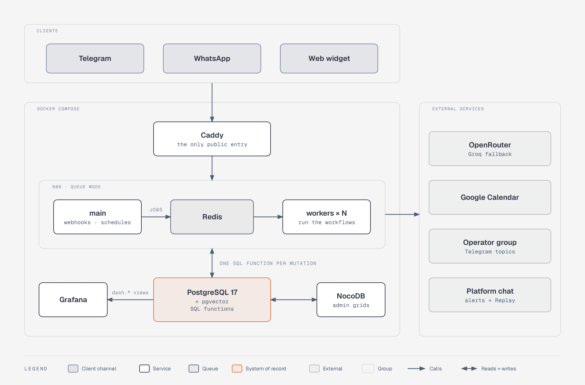
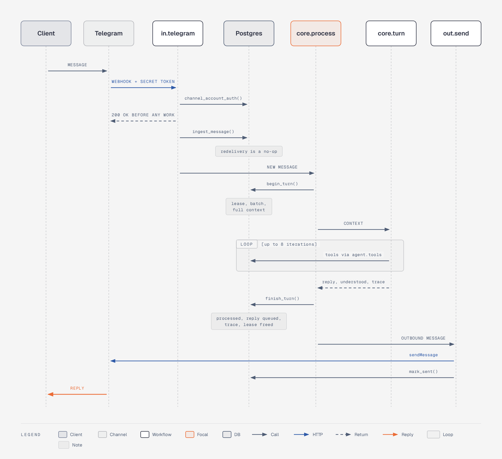
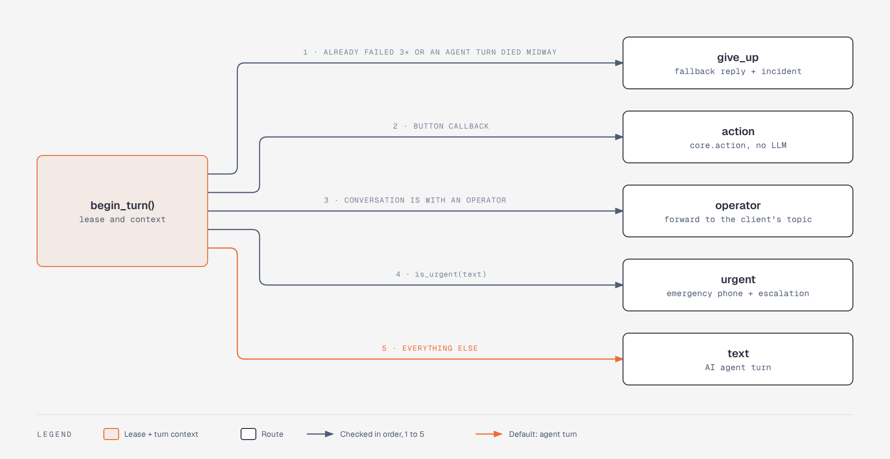
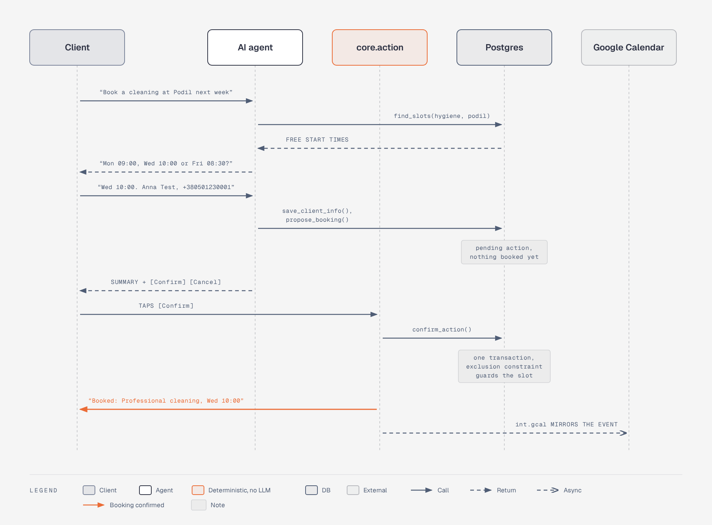
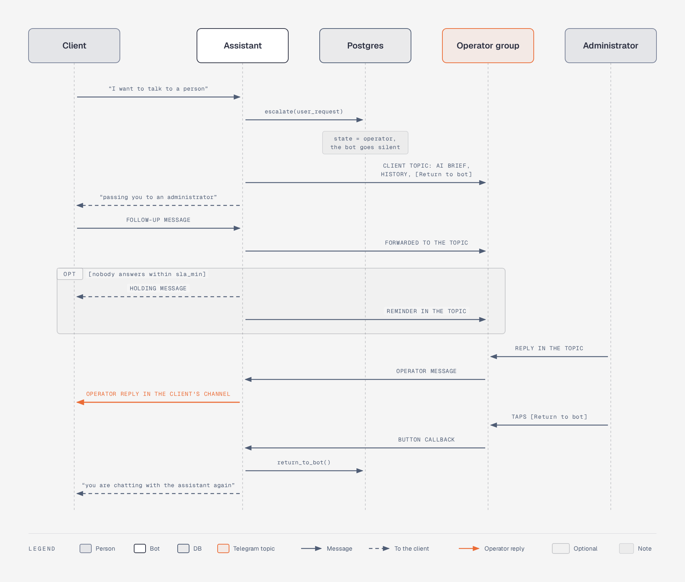
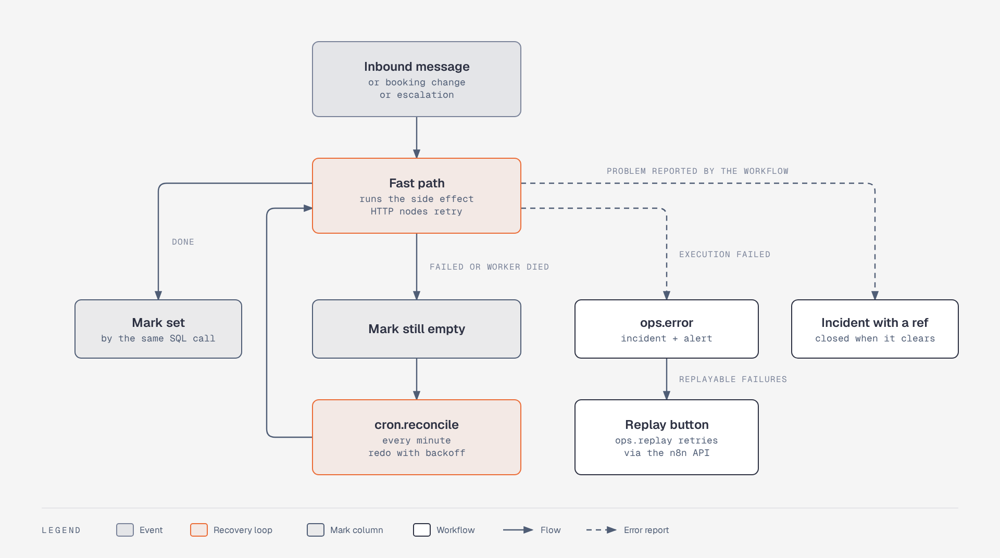
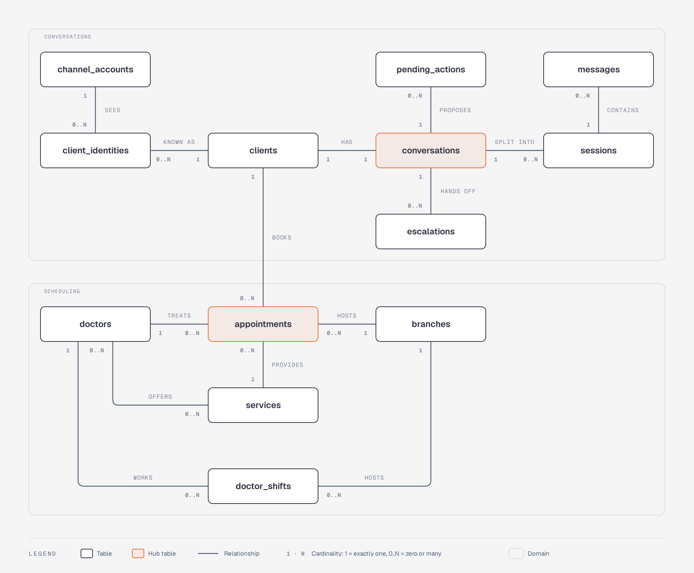
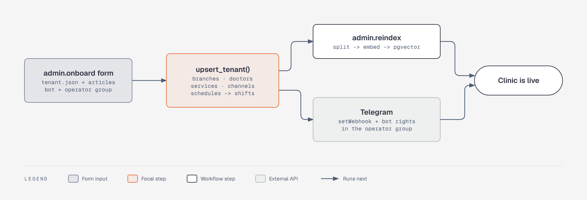
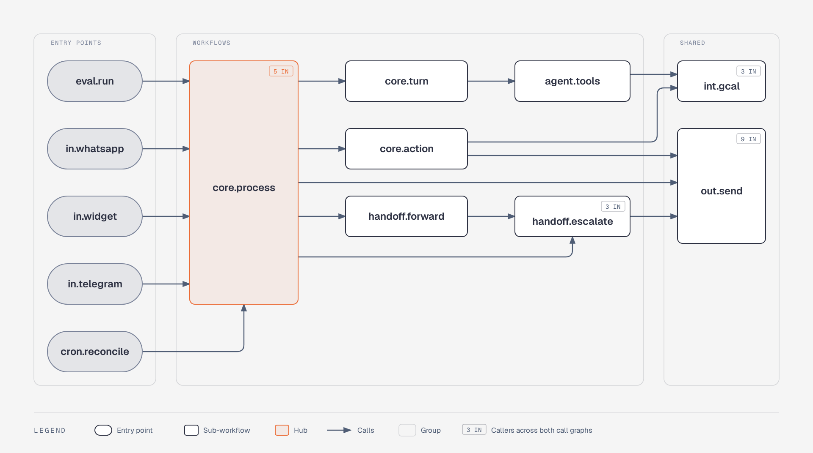
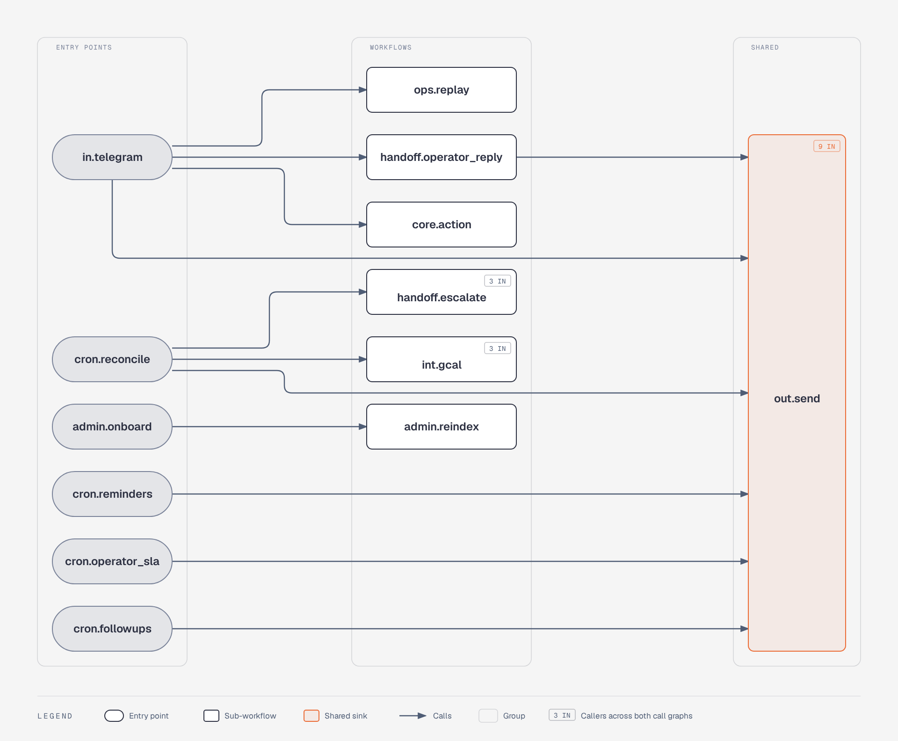

<div align="center">

# Greeter

**AI front desk for dental clinics, built entirely in n8n**


</div>

Greeter is a multi-clinic virtual receptionist. Patients write in Telegram, WhatsApp or a website chat. The
assistant answers from the clinic's own data and books, reschedules and cancels visits, always after an explicit
confirmation. It mirrors bookings to Google Calendar, sends reminders, and hands the conversation to a human in
the clinic's Telegram group when needed.

The application is built from n8n workflows. PostgreSQL functions and constraints keep the invariants:
idempotent webhooks, no double booking, tenant isolation.

| | |
| --- | --- |
| **Channels** | Telegram bot · WhatsApp Cloud API · embeddable web widget |
| **Languages** | Replies in the client's language: English, Ukrainian, Russian |
| **Models** | OpenRouter (default `openai/gpt-4.1-mini`) with Groq as the fallback; any tool-calling model per clinic |
| **Throughput** | 100 concurrent dialogs, 0 lost messages, reply p95 4.2 s on 2 workers ([report](reports/load-2026-09-27.md)) |
| **Quality gates** | 46 agent evaluation scenarios, SQL test suites, a static linter for workflows |
| **Setup** | One command, `./scripts/bootstrap.sh`; runs offline against built-in API stubs |

## Contents

- [Features](#features)
- [Architecture](#architecture)
- [How a message is handled](#how-a-message-is-handled)
- [Bookings: the model proposes, the client confirms](#bookings-the-model-proposes-the-client-confirms)
- [Human handoff](#human-handoff)
- [Reliability](#reliability)
- [Data model](#data-model)
- [Quick start](#quick-start)
- [Connecting real services](#connecting-real-services)
- [Onboarding a clinic](#onboarding-a-clinic)
- [Workflows](#workflows)
- [Quality](#quality)
- [Acceptance criteria](#acceptance-criteria)
- [Observability](#observability)
- [Security](#security)
- [Deploying to a VPS](#deploying-to-a-vps)
- [Development](#development)
- [Repository layout](#repository-layout)
- [Limitations and roadmap](#limitations-and-roadmap)

## Features

**Conversations**
- Telegram, WhatsApp and the web widget all land in one model: client → conversation → sessions → messages.
  Context survives between sessions.
- Profiles are glued across channels only by a phone number the channel proves: the WhatsApp sender, or a
  Telegram contact shared from the client's own account. A number typed in the chat stays on its own profile;
  the operator card flags the possible duplicate.

**AI agent**
- n8n AI Agent with a model chosen per clinic and a fallback model.
- Services, prices, doctors, branches and opening hours go into the prompt straight from SQL: exact, never
  retrieved. Everything else (aftercare, payment, insurance, parking...) comes from the clinic's knowledge base
  through pgvector search, filtered by clinic.
- Eight tools: `search_kb`, `find_slots`, `save_client_info`, `propose_booking`, `propose_reschedule`,
  `propose_cancel`, `confirm_action`, `escalate`. Clinic and client ids come from the turn context, never from
  the model.

**Safety**
- Keyword rules in EN, UK and RU catch urgent symptoms (severe pain, swelling, bleeding, trauma) before the
  LLM runs. The client gets the emergency phone at once and the clinic gets an urgent card. Symptoms the client
  reports count; general questions ("how long does swelling last?") and negations ("no pain") go to the agent.
- No diagnoses and no invented prices. When neither the clinic data nor the knowledge base has the answer, the
  assistant says so and offers an administrator.
- Client text is treated as data. Prompt injection is part of the evaluation suite.

**Bookings and the patient lifecycle**
- Two-step changes: the model proposes, the client confirms with a button or in words, and one SQL function
  applies the change. Exclusion constraints make double booking impossible for both doctors and clients.
- Confirmations, plus reminders 24 h and 2 h before the visit with *I'll come / Reschedule / Cancel* buttons.
- Google Calendar mirror per branch or doctor (service account, idempotent event ids).
- Follow-ups: a review request after a visit (a low score reaches the operator as a complaint), a rebooking offer
  after a no-show, and reactivation of dormant clients with a daily cap.

**Human handoff**
- Each client gets a forum topic in the clinic's Telegram supergroup with an AI brief and the history. Operator
  replies go back to the client's channel, and the bot stays silent until *Return to bot*.
- Operator SLA: if nobody answers in N minutes, the client gets a holding message and the topic gets a reminder.
- A clinic without a reachable operator group keeps the bot: the client gets the clinic phone and the platform
  gets an alert.

**Platform**
- Multi-tenant: a clinic is a `tenant.json` plus Markdown articles, connected through an n8n form. No workflow
  changes per clinic.
- Operations: a per-session trace linked to n8n executions, Grafana dashboards, token usage and cost, Telegram
  alerts with a *Replay* button, and NocoDB grids for clinic data.

## Architecture



| Service | Image | Role |
| --- | --- | --- |
| `n8n` | `n8nio/n8n:2.40.7` | Main process: webhooks, schedules, editor, built-in MCP server |
| `n8n-worker` | `n8nio/n8n:2.40.7` | Runs executions from the queue; scale with `--scale n8n-worker=N` |
| `postgres` | `pgvector/pgvector:pg17` | Database `n8n` for n8n itself; database `app` for the application, SQL functions and vectors |
| `redis` | `redis:8.8-alpine` | n8n execution queue |
| `caddy` | `caddy:2.11-alpine` | The only public entry: channel webhooks, demo page, Grafana; automatic TLS in production |
| `grafana` | `grafana/grafana-oss:13.0.2` | Dashboards over the `dash.*` reporting views |
| `nocodb` | `nocodb/nocodb:2026.09.0` | Admin grids over the `app` database |
| `stub` | `node:22-alpine` | Fake Telegram, LLM and embeddings, Google OAuth and Calendar, and WhatsApp APIs (profile `stub`) |
| `k6` | `grafana/k6:2.3.0` | Load test runner (profile `load`) |
| `tunnel` | `cloudflare/cloudflared` | Public HTTPS URL for local development (profile `tunnel`) |

### Design decisions

1. **n8n is the application.** Webhooks, dialog, agent, booking, handoff, reminders, integrations, alerts,
   onboarding and evaluations are all workflows. `n8n/workflows/*.json` is the source of truth.
2. **Invariants live in Postgres.** n8n has no transactions across nodes, so every change is a single call to an
   SQL function, which runs as one transaction. Unique keys make webhooks idempotent. Exclusion constraints stop
   double booking no matter who writes the row: the bot, the admin grid or raw SQL.
3. **Reliability without a custom queue.** Side effects run immediately. Each one also has a mark column, and
   `cron.reconcile` finishes anything left undone every minute. Failed executions act as the dead-letter queue
   (see [Reliability](#reliability)).
4. **One turn per conversation at a time.** A lease on the conversation row serializes turns. Messages that arrive
   during a turn are batched into the next one.
5. **The model changes nothing by itself.** Changes are two-step proposals, applied only after the client
   confirms.
6. **Tenant isolation by construction.** Every tenant row carries `tenant_id`, and references between tenant
   tables are composite `(tenant_id, id)` foreign keys. Tools take tenant and client ids from the turn context,
   never from `$fromAI`, and `scripts/check-workflows.sh` rejects workflows that try.

## How a message is handled



- `ingest_message()` stores the message under a unique `(channel account, external id)` key, so a redelivered
  webhook changes nothing.
- `begin_turn()` takes the conversation lease, batches every unprocessed message and returns the whole turn
  context in one call.
- `finish_turn()` marks the batch processed, queues the reply with its buttons, writes the trace and frees the
  lease in one transaction.

WhatsApp and the web widget enter through their own `in.*` workflows and join the same pipeline; widget replies
are delivered by polling instead of a push. If another execution holds the lease, `begin_turn()` returns nothing
and the execution exits. Otherwise the turn is routed before any LLM call, checking these conditions in order:



An agent turn that did not finish is never run again, because the LLM would be paid twice and its tools could
act twice. The client gets a clear fallback message and an administrator instead.

Agent turns use a layered prompt:

- Platform rules: facts, medical safety, booking order, handoff, security, style.
- The clinic block, rendered from SQL: branches, hours, doctors, services with prices, tone.
- The client's profile and upcoming appointments, open proposals, and the last 20 messages.

The agent returns structured output `{reply, understood}`. Two misunderstood messages in a row escalate to an
operator.

## Bookings: the model proposes, the client confirms



- Button callbacks are handled deterministically by `core.action`, without the LLM, and are idempotent.
- Instead of tapping the button, the client may answer "yes"; the agent then calls its `confirm_action` tool.
  The "yes" counts only for a proposal the client had already seen, so neither the model within one turn nor a
  "yes" sent before the proposal appeared can confirm it.
- A proposal (`pending_actions`) ends up `confirmed`, `rejected`, `expired` (after 30 minutes, or when a newer
  proposal replaces it) or `failed` (the slot was taken meanwhile; the client is offered another time).
- Rescheduling and cancelling use the same flow. The agent refers to the client's upcoming appointments as
  `A1`, `A2`..., and reminder buttons lead to the same confirmation.
- Any change to an appointment, from any source, re-arms the calendar mirror and the reminders through a table
  trigger.

## Human handoff



The assistant escalates for six reasons: the client asks for a person, a complaint, a medical question, urgent
symptoms, two misunderstood messages in a row, or a tool failure. The topic is created once per client and
reused. If it gets deleted in the group, the next card creates a new one.

## Reliability



| Side effect | Mark | Finished by |
| --- | --- | --- |
| Inbound message handled | `messages.processed_at` | `cron.reconcile` → `core.process` |
| Reply delivered | `messages.sent_at` | `cron.reconcile` → `out.send`, backoff from 30 s doubling up to 1 h, about 5 h in total |
| Calendar mirror | `appointments.gcal_synced_at` | `cron.reconcile` → `int.gcal`, backoff from 1 min doubling up to 1 h |
| Operator card posted | `escalations.notified_at` | `cron.reconcile` → `handoff.escalate` |
| Reminders | `reminder_24h_sent_at`, `reminder_2h_sent_at` | `cron.reminders`, every 5 min |
| Operator SLA | `conversations.sla_notified_at` | `cron.operator_sla`, every minute |
| Follow-ups | `followup_sent_at`, `reactivation_sent_at` | `cron.followups`, every 15 min and daily |
| Token usage | `usage_scans.scanned_until` | `cron.usage`, every 5 min |

`cron.reconcile` finishes turns, deliveries, handoffs and calendar syncs anyway, so their failures alert
without a Replay button: a replay would forward, send or book twice. Failures a workflow handles itself are
reported to `ops.error` too, as one incident per problem that closes when the problem clears:

- a reply that cannot be delivered (for example, a revoked channel token)
- a calendar that refuses a sync
- both models down
- a clinic without an operator

Alerts are deduplicated to one per workflow and node every 10 minutes.

## Data model



The invariants are enforced by the schema itself:

| Table | Constraint | Guarantees |
| --- | --- | --- |
| every tenant table | `tenant_id` plus composite `(tenant_id, id)` foreign keys | A row can never point into another clinic |
| `messages` | unique `(channel_account_id, external_id)` for inbound messages | A redelivered webhook is a no-op |
| `appointments` | `EXCLUDE USING gist` on doctor and period, and on client and period, for booked visits | No double booking, whoever writes the row |
| `doctor_shifts` | `EXCLUDE USING gist` on doctor and period | A doctor is in one place at a time |
| `conversations` | unique `client_id`, plus a `lease_until` lease | One conversation per client, one turn at a time |
| `clients` | unique `(tenant_id, phone)` for verified phones | A proven number belongs to one person |

- Not shown: `tenants`, the knowledge base chunks, the trace, LLM usage, incidents and the widget's rate limits.
- **Sessions** are episodes for metrics: a new one starts after 12 hours of silence.
- **Grafana** reads only the `dash` schema; **NocoDB** sees only clinic setup, clients and appointments.
- 82 SQL functions across 8 migrations cover ingestion, turns, booking, handoff, reconciliation, reporting and
  onboarding.

## Quick start

Requirements: Docker with Compose v2, bash, curl, jq and openssl.

```bash
git clone https://github.com/0xNaezo/Greeter.git
cd Greeter
./scripts/bootstrap.sh
```

The script is safe to re-run: every step converges. It runs these steps in order:

1. Creates `.env` and fills every empty secret with a generated value.
2. Starts the stack and applies the database migrations.
3. Creates the n8n owner and an API key.
4. Imports credentials with fixed ids, then lints, imports and publishes the workflows.
5. Loads the clinics from `tenants/` and registers Telegram webhooks.
6. Indexes the knowledge bases.
7. Seeds about six months of demo history (220 clients).
8. Syncs the evaluation dataset.
9. Connects NocoDB, publishes the public Grafana dashboard and writes `web/config.js`.

On an empty Docker host this takes about 45 s plus image pulls; a re-run converges in about 10 s.

| What | Where |
| --- | --- |
| Demo clinic page with the chat widget | http://localhost:8080 |
| n8n editor: workflows, executions, evaluations | http://localhost:5678 |
| Clinic onboarding form | http://localhost:5678/form/onboard |
| Grafana admin dashboards | http://localhost:8080/grafana |
| Public demo dashboard | link printed by bootstrap (`/grafana/public-dashboards/...`) |
| NocoDB admin grids | http://localhost:8081 |

Logins and passwords are in `.env`. To try the assistant, use the demo page and ask "How much is whitening?",
"Book a cleaning at Podil next week", "I have strong pain and swelling" or "I want to talk to a person".

> [!TIP]
> **No API keys needed to start.** Without keys, every external API is served by `stub/`, so the whole pipeline
> works offline. The stub LLM executes `/tool <name> {json}` directives found in a message, so you can drive any
> tool by hand. Every stub call is logged at `http://localhost:3900/_calls`. Failure switches are built in: a
> Telegram token containing `fail500` or `fail403`, a model name containing `fail`, `Authorization: Bearer bad`,
> or a calendar id containing `revoked`.

Everyday commands:

```bash
docker compose ps                            # service health
docker compose logs -f n8n-worker            # worker logs
docker compose up -d --scale n8n-worker=4    # more throughput
docker compose down                          # stop (add -v to wipe all local data)
```

## Connecting real services

Put the keys into `.env` and run `./scripts/bootstrap.sh` again. The workflows do not change.

| Variable | Used for |
| --- | --- |
| `OPENROUTER_API_KEY` | Chat model (`config.models.openrouter` in `tenant.json`) and knowledge base embeddings (`openai/text-embedding-3-small`). Needs a few dollars of credit; set a credit limit on the key. |
| `GROQ_API_KEY` | Fallback model (free tier) |
| `DEMO_TG_BOT_TOKEN`, `DEMO_TG_OPERATOR_CHAT_ID` | Demo clinic bot, and the operator supergroup (topics on, the bot is an admin with *Manage topics*) |
| `PLATFORM_TG_BOT_TOKEN`, `PLATFORM_TG_CHAT_ID` | Error alerts with the Replay button; the clinic bot's token works too |
| `GOOGLE_SA_EMAIL`, `GOOGLE_SA_PRIVATE_KEY`, `DEMO_GCAL_*` | Google service account; share each branch calendar with it |
| `WA_APP_SECRET`, `DEMO_WA_PHONE_NUMBER_ID`, `DEMO_WA_TOKEN` | WhatsApp Cloud API test number |
| `WEBHOOK_URL` | Public HTTPS base URL; Telegram and Meta need it to deliver webhooks |

**Public URL for development.** Start a quick tunnel with `docker compose --profile tunnel up -d tunnel`, take
the `trycloudflare.com` address from `docker compose logs tunnel`, set `WEBHOOK_URL` to it and re-run bootstrap.
Any HTTPS tunnel to port 8080 works the same way. Where `api.trycloudflare.com` is blocked, use
`ssh -R 80:localhost:8080 nokey@localhost.run`, or ngrok with its free static domain (the URL then survives
restarts).

**WhatsApp.** In the Meta app, set the callback URL to `<WEBHOOK_URL>webhook/wa/<account id>`, set the verify
token to that account's secret, and subscribe to `messages`. Both values:

```bash
docker compose exec -T postgres psql -U n8n -d app -Atc \
  "select id, webhook_secret from channel_accounts where channel = 'whatsapp'"
```

**Web widget on a clinic site.** Embed the script and list the site in `WIDGET_ORIGINS` (CORS):

```html
<script src="https://<domain>/widget.js"
        data-endpoint="https://<domain>/webhook/widget/<widget channel account id>"
        data-title="Smile Studio"></script>
```

## Onboarding a clinic

A clinic is data, not code. Open the onboarding form at `/form/onboard` and upload three things:

- a `tenant.json`
- its knowledge base articles in Markdown
- optionally, a Telegram bot token and the operator group id



Re-uploading updates the clinic. Clinics kept in the repo under `tenants/<slug>/` are loaded by bootstrap the
same way. The form run takes about a second; almost all of the ~15 minutes the spec allows for a new clinic go
into writing `tenant.json` and the articles. A ready example is in `tenants/examples/smile` (abridged here):

```json
{
  "slug": "smile",
  "name": "Smile Studio",
  "timezone": "Europe/Kyiv",
  "llm_profile": "openrouter",
  "config": {
    "tone": "Friendly and brief, like a good receptionist. Plain words, no emojis.",
    "languages": ["uk", "en"],
    "default_lang": "uk",
    "emergency_phone": "+380 32 000 22 11",
    "operator": { "chat_id": null, "sla_min": 15 },
    "booking": { "slot_step_min": 30, "lead_min": 120, "horizon_days": 21 },
    "models": { "openrouter": "openai/gpt-4.1-mini", "groq": "llama-3.3-70b-versatile" }
  },
  "branches": [{ "slug": "rynok", "name": "Smile Studio Rynok", "hours": { "mon": "09:00-19:00", "sun": null } }],
  "services": [{ "slug": "hygiene", "name": "Professional cleaning", "price": 1500, "duration_min": 60 }],
  "doctors": [{
    "slug": "senyk", "name": "Oksana Senyk", "services": ["hygiene"],
    "schedule": [{ "branch": "rynok", "days": ["mon", "wed", "fri"], "from": "10:00", "to": "18:00" }]
  }],
  "channels": [{ "channel": "widget", "external_id": "smile-widget" }]
}
```

| Key | Meaning |
| --- | --- |
| `config.tone`, `languages`, `default_lang` | Voice and languages of the assistant |
| `config.emergency_phone` | Sent at once when urgent symptoms are detected |
| `config.operator` | Operator supergroup (`chat_id`) and reply SLA in minutes (`sla_min`) |
| `config.booking` | Slot grid, minimum lead time, booking horizon |
| `config.followups` | Review requests, no-show offers, reactivation (`after_months`, `daily_limit`) |
| `config.models` | Chat model per provider |
| `branches[].hours`, `doctors[].schedule` | Opening hours and weekly schedules, materialized into shifts for the booking horizon |
| `channels[]` | Widget, Telegram and WhatsApp accounts; tokens are stored encrypted |
| `env`, `extends` | Only for clinics kept in the repo: secrets referenced by `.env` variable name, and inheritance from another tenant |

## Workflows

| Workflow | Trigger | Role |
| --- | --- | --- |
| `in.telegram` | webhook `tg/<account>` | Secret check, ack, routing of client messages, buttons and operator replies |
| `in.widget` | webhook `widget/<account>/{session,send,poll}` | Web chat with HMAC-signed visitor tokens, input checks and rate limits |
| `in.whatsapp` | webhook `wa/<account>` | Meta verification, `X-Hub-Signature-256` check, messages and button replies, verified phone glue |
| `core.process` | sub-workflow | Lease, context in one SQL call, routing, finish, send, next turn |
| `core.turn` | sub-workflow | AI Agent with model selector, fallback model, tools and structured output |
| `agent.tools` | sub-workflow | `search_kb`, `find_slots`, `save_client_info`, `propose_*`, `confirm_action`, `escalate` |
| `core.action` | sub-workflow | Deterministic buttons: confirm or reject, reminder answers, reviews, return to bot |
| `out.send` | sub-workflow | Delivery to Telegram and WhatsApp, `sent_at` marks, failure classification |
| `handoff.escalate` | sub-workflow | AI brief, operator topic and card |
| `handoff.forward` | sub-workflow | Client messages to the operator topic |
| `handoff.operator_reply` | sub-workflow | Operator messages to the client's channel |
| `int.gcal` | sub-workflow | Google Calendar mirror via a service account JWT, idempotent event ids |
| `cron.reconcile` | every minute | Redoes whatever a mark says is unfinished |
| `cron.reminders` | every 5 min | 24 h and 2 h reminders with buttons |
| `cron.operator_sla` | every minute | Holding message to the client and a reminder in the topic |
| `cron.followups` | every 15 min, daily at 11:00 | Reviews, no-show offers, reactivation, shift calendar extension |
| `cron.usage` | every 5 min | Token usage of agent turns and handoff briefs from the n8n API into `llm_usage` |
| `ops.error` | error trigger, sub-workflow | Incidents and alerts |
| `ops.replay` | platform bot webhook | Replay button: retries the failed execution |
| `admin.onboard` | form | Clinic onboarding |
| `admin.reindex` | webhook, sub-workflow | Knowledge base indexing |
| `eval.run` | Evaluation trigger | Agent evaluation through the real pipeline |

<details>
<summary><b>Workflow call graph</b></summary>

Rounded nodes are entry points: webhooks, schedules, the form and the evaluation trigger. Every workflow uses
`ops.error` as its error workflow; those edges are omitted. `core.process` also calls itself when more messages
arrived during a turn.

The graph is drawn in two parts: the turn pipeline around `core.process`, then the direct routes of
`in.telegram`, the schedules and admin. A badge counts a workflow's callers across both parts.





</details>

## Quality

| Check | Command | Result |
| --- | --- | --- |
| SQL function tests: ingest, turns, booking, operator flows, tenants, P1 | `scripts/migrate.sh --test` | Green. Runs on a throwaway `app_test` database; each suite runs inside a rolled-back transaction |
| Workflow rules | `scripts/check-workflows.sh` | Green |
| Load test: 100 concurrent Telegram dialogs × 5 messages | `scripts/load.sh` | 0 lost, reply p95 4.2 s with 2 workers ([report](reports/load-2026-09-27.md)) |
| Agent evaluation: 46 scenarios | `scripts/eval.sh` | Needs real LLM keys: a few hundred model calls, well under $1 on the default model |

**Workflow rules.** `check-workflows.sh` runs on every export and enforces these rules:

- SQL only through functions, never raw table access.
- Retry On Fail on HTTP and Telegram nodes, or a `no retry:` note explaining why not.
- `ops.error` as the error workflow everywhere.
- No ids from `$fromAI`.
- Only credentials and sub-workflows that bootstrap provisions.
- No hardcoded secrets, and at most 40 nodes per workflow.

**Agent evaluation.** `eval.run` drives the real pipeline. A scripted client of the `eval` tenant writes through
its widget account, `core.process` handles each turn, and the outcome is read back from the database. Each
scenario is scored on six metrics:

- expected tools used, and forbidden tools not used
- escalation and its reason
- booking outcome
- no amount outside the clinic price list
- reply language
- expected and forbidden content

Run history is kept in n8n Evaluations, and each run writes `reports/eval-<date>.md`.

| Category | Scenarios | | Category | Scenarios |
| --- | --- | --- | --- | --- |
| Booking | 6 | | Urgent symptoms | 4 |
| Rescheduling | 3 | | Medical questions | 2 |
| Cancelling | 4 | | Handoff | 2 |
| Prices | 6 | | Not understood | 1 |
| Knowledge base | 6 | | Prompt injection | 5 |
| Out of knowledge base | 4 | | Mixed languages | 3 |

**Load test.** The test runs on the `loadtest` clinic with the stub LLM (1–3 s latency), so it measures the
system rather than the provider's rate limits. Profiling showed that n8n's default isolated-vm expression engine
used most of the worker CPU. The in-process engine cuts worker CPU about 4×:

| Expression engine | Workers | Reply p50 / p95 |
| --- | --- | --- |
| isolated-vm (n8n default) | 8 | 5.0 / 12.9 s |
| in-process (`legacy`) | 2 | 2.4 / 4.2 s |
| in-process (`legacy`) | 4 | 2.4 / 3.9 s |

The in-process engine is safe here because only the platform admin edits workflows and client text never
becomes an expression; [Security](#security) covers the trade-off. Messages are never lost either way: an
overloaded system only answers later.

## Acceptance criteria

| # | Criterion | Status |
| --- | --- | --- |
| 1 | Booking in Telegram within 6 messages, row in the database and in Google Calendar | Works end to end on the stubs; to confirm with real OpenRouter and Calendar keys |
| 2 | Reschedule and cancel from the dialog and from reminder buttons | Done |
| 3 | No invented answers outside the knowledge base, operator offered | Prompt, tools and eval scenarios in place; to confirm with a real model |
| 4 | "Severe pain and swelling": instant escalation and a proper message | Done, before the LLM |
| 5 | Operator reply reaches the client's channel; the bot stays silent until handed back | Done |
| 6 | A redelivered webhook creates no second message or booking | Done |
| 7 | LLM or Calendar down: retries, alert, clear message to the client, no data lost | Done. Drilled on the stubs: both models down, calendar access revoked, channel token revoked |
| 8 | New clinic by config only, in about 15 minutes | Done (onboarding form) |
| 9 | 100 parallel dialogs, 0 lost messages, p95 ≤ 6 s | Done: p95 4.2 s |
| 10 | Eval set passes at 90% or more | Harness ready; needs a run with real LLM keys |

## Observability

- **Trace.** Every session has a trace with incoming and outgoing messages, the route, tool calls with inputs
  and outputs, decisions and errors. Steps carry the n8n execution id, so the trace works as an index and the
  execution holds the full detail.
- **Dashboards.** Grafana reads only the `dash.*` views. The public demo dashboard shows the spec's metrics for the
  demo clinic:
  - dialogs, bookings, and dialog → booking conversion
  - share of dialogs handled without an operator, and escalations by reason
  - no-shows
  - assistant reply time
  - LLM cost per dialog
  - operator first-reply time

  Behind the login you get the same metrics with clinic, branch and period filters, plus an operations
  dashboard (incidents, dialogs, appointments, clients, escalations) and the per-session trace.
- **Cost.** `cron.usage` reads token counts from agent and handoff executions through the n8n API and prices
  them at paid-tier list prices, even on a free tier.
- **Alerts.** Alerts go to the platform Telegram chat, at most one per workflow and node every 10 minutes, with a
  Replay button where a retry is safe.

## Security

- **Public surface.** Only what Caddy routes is public: channel webhooks, the demo page and Grafana. Each webhook
  checks its secret: the Telegram `secret_token`, the WhatsApp app signature, or signed widget tokens. Admin
  webhooks need `ADMIN_TOKEN`. The n8n editor, its forms and NocoDB listen on localhost only.
- **Secrets.** Secrets live in `.env` and in n8n credentials, which bootstrap creates with fixed ids. Workflow
  JSON references credentials by id only, and `check-workflows.sh` rejects hardcoded keys. Channel tokens are
  encrypted in the database with `APP_ENCRYPTION_KEY`.
- **Grafana.** No anonymous access, because in Grafana OSS any viewer can query any datasource. The demo is a
  shared dashboard link, and the Grafana database role reads only the `dash` views.
- **Web widget.** The widget is anonymous, so several layers protect it:
  - `widget_gate` (SQL counters) limits sessions and messages per IP and per visitor and rejects malformed input.
  - Caddy caps the request body at 16 KB and answers CORS only for `WIDGET_ORIGINS`.
  - Give the OpenRouter key a credit limit anyway. Behind the dev tunnel, all visitors share the tunnel's address.
- **Prompt injection.** Client text is data: the prompt says so, the tools cannot change clinic or client ids,
  and every booking change needs the client's confirmation. Evaluation scenarios cover prompt injection.
- **Single-admin trade-offs.** n8n runs the in-process expression engine, and workflows read settings from `$env`
  (see `docker-compose.yml`). Both are safe only while the n8n editor stays private.

## Deploying to a VPS

1. Set `SITE_ADDRESS` to the domain, with `CADDY_HTTP_PORT=80` and `CADDY_HTTPS_PORT=443`. Caddy obtains TLS
   certificates automatically.
2. Set `WEBHOOK_URL=https://<domain>/` and `GRAFANA_ROOT_URL=https://<domain>/grafana/`.
3. Set `COMPOSE_PROFILES=` to empty, so no stub runs, and add the real keys.
4. Run `./scripts/bootstrap.sh`.

Only webhooks, the demo page and Grafana are public. Reach n8n and NocoDB through an SSH tunnel.

## Development

- **Workflows are code.** Edit a workflow in the n8n editor, then run `scripts/export-workflows.sh`. It writes
  the JSON back to `n8n/workflows/` and runs the linter. If the Claude Code CLI is installed, bootstrap also
  registers two n8n MCP servers (`n8n-mcp` and n8n's built-in one) for AI-assisted workflow editing.
- **Rules of the codebase:**
  - One mutation is one SQL function call.
  - Every SQL query on tenant data filters by `tenant_id`.
  - A new side effect gets a mark column and a branch in `cron.reconcile`.
  - External HTTP nodes retry.
  - A workflow over ~40 nodes is split into sub-workflows.
  - A new environment variable goes into `.env.example` right away.
  - A prompt or model change triggers an evaluation run.
- **Database.** Add `db/migrations/NNN_<name>.sql`; `scripts/migrate.sh` applies pending migrations in order.
  Tests are plain SQL with `ASSERT` in `db/tests/`.

## Repository layout

```
docker-compose.yml   Caddyfile   .env.example
db/migrations/       schema, SQL functions, reporting views, grants
db/tests/            SQL tests (scripts/migrate.sh --test)
db/seed/             demo history for the dashboards
n8n/workflows/       workflow JSON, the source of truth
tenants/             clinic configs and knowledge bases; examples/ for the onboarding form
evals/               agent evaluation scenarios
load/                k6 load test
web/                 demo clinic page and widget.js
grafana/             datasource and dashboard provisioning
stub/                fake Telegram, LLM, Google and WhatsApp APIs
reports/             load test reports
scripts/             bootstrap, migrations, workflow export and checks, evals, load test
```

The demo clinic, **Lumina Dental**, is fictional: two branches in Kyiv, five doctors, 16 services and 27
knowledge base articles, with synthetic history.

## Limitations and roadmap

- The web widget polls for replies (every second while waiting for a reply, every 3 s otherwise), and every
  poll is an n8n execution. That is fine for a demo; real traffic would need a push channel outside n8n.
- Urgent-symptom detection is keyword-based. A small classifier is the upgrade path if evaluations show misses.
- The decrypted channel token appears in the execution data of `out.send`. Successful executions of that
  workflow are not saved, failed ones expire with `EXECUTIONS_DATA_MAX_AGE` (14 days), and the n8n editor is
  admin-only.
- Tenant isolation relies on `tenant_id` filters inside the SQL functions, composite foreign keys, the SQL tests
  and the workflow linter, not on row-level security: each Postgres node is its own transaction, so there is no
  session context to hang RLS on.
- Next on the roadmap is a voice channel (Retell or Vapi). Payments, a mobile app and integration with real
  medical record systems are out of scope.
